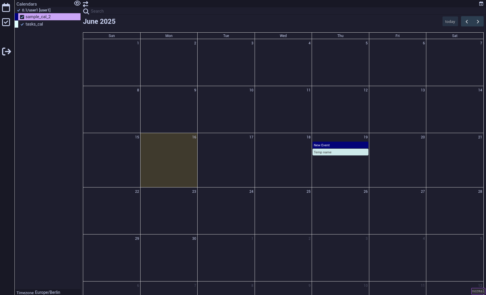

This is an attempt to go beyond a simple facelift and actually update dependencies.
As expected, most things are broken ATM.

Progress so far:

* All the stuff from the initial facelift commit
* New jquery with only a few deprecation warnings left
* Some more hacky workarounds from 2015 removed
* Transitioning to a new version of full-calendar
